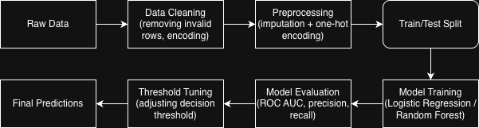

# Predicting Mental Health Treatment from Workplace Factors

This project builds a machine learning model to predict whether an employee seeks mental health treatment based on workplace-related factors.

---

## 📊 Overview

The goal is to understand how workplace conditions influence treatment-seeking behavior.

The project focuses on:
- data preprocessing and feature engineering  
- classification modeling  
- model evaluation and threshold tuning  
- extracting insights from the model  

---

## 🗂 Data

This project uses the *Mental Health in Tech Survey (2014)* dataset.

Source: https://www.kaggle.com/datasets/osmi/mental-health-in-tech-survey

A small sample of the dataset is included in `data/sample.csv`.

---

## ⚙️ Methodology

- Data cleaning and preprocessing (handling missing values, encoding categorical variables)
- Feature selection focused on workplace-related factors
- Models:
  - Logistic Regression  
  - Random Forest  
- Handling class imbalance with SMOTE  
- Model evaluation using ROC AUC, precision, recall  
- Threshold tuning to prioritize recall for the positive class  

---

## 📈 Pipeline Overview

The following diagram summarizes the full modeling pipeline used in this project:



---

## 📈 Results

- Logistic Regression performed best on the test set  
- ROC AUC ≈ 0.80  

Key observations:
- mental health interfering with work is the strongest signal  
- access to care options and benefits matters  
- workplace openness plays a role in treatment-seeking behavior  

---

## ▶️ How to Run

Install dependencies:

```bash
pip install -r requirements.txt
```

---

## 📝 Notes

- The dataset is based on self-reported survey data
- The model captures associations, not causal relationships
- Results may not generalize beyond the tech industry

---

## 🚀 Next Steps

- test additional models
- include more features
- validate results on other datasets
- deploy the model as an API
